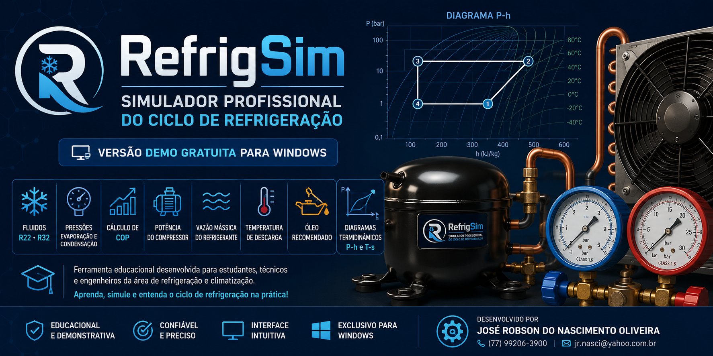

# RefrigSim

 

## Simulador Educacional do Ciclo de Refrigeração

O **RefrigSim Demo** é um simulador desenvolvido para estudantes, técnicos e engenheiros da área de refrigeração e climatização.

### Recursos disponíveis

- ✅ Fluidos refrigerantes: **R22** e **R32**
- ✅ Pressão de evaporação
- ✅ Pressão de condensação
- ✅ Cálculo do COP
- ✅ Potência estimada do compressor
- ✅ Vazão mássica do refrigerante
- ✅ Temperatura de descarga
- ✅ Tipo de óleo recomendado
- ✅ Diagramas termodinâmicos (P-h)

## Download

➡️ Baixe a versão mais recente em **Releases**.

## Licença

Versão gratuita destinada exclusivamente para fins educacionais e treinamento técnico.

---

**Desenvolvido por**

**José Robson do Nascimento Oliveira**

📱 (77) 99206-3900

📧 jr.nasci@yahoo.com.br
